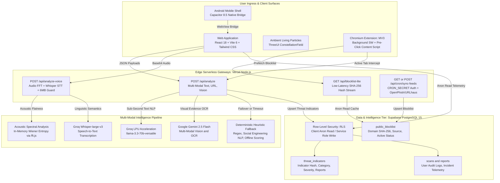

# GhostNet AI — Autonomous Multi-Modal Cyber Defense Platform

**See the scam before it sees you.**

GhostNet AI is an enterprise-grade, multi-modal cybersecurity and digital fraud prevention platform. It detects, explains, and neutralizes social engineering attacks across suspicious messages (SMS, WhatsApp, email), deceptive URLs, screenshots, QR codes, deepfake synthetic phone calls, and live web browsing in real-time.

[](https://ghost-net-zeta.vercel.app)
[](tests/scanner.test.js)
[](LICENSE)
[](https://react.dev)
[](https://vitejs.dev)
[](https://tailwindcss.com)
[](https://supabase.com)
[](https://capacitorjs.com)
[](extension/)

---

## 🌐 Live Production Deployment

* **Production URL:** [https://ghost-net-zeta.vercel.app](https://ghost-net-zeta.vercel.app)
* **Judge / Guest Access:** Instant 1-click **⚡ Explore as Guest / Judge Demo Mode** on the login screen.
* **Hardware Permissions:** Configured with `Permissions-Policy: camera=(self), microphone=(self), geolocation=()` for seamless browser camera and microphone access.

---

## 📌 Problem & Solution

Digital fraud and AI-engineered social engineering scams cause over **$10 Billion in annual losses worldwide**. Cybercriminals weaponize generative AI to automate spear-phishing, synthesize deceptive lookalike domains, clone banking portals, and replicate executive voices in voice calls.

Traditional antivirus and threat filters act as opaque black boxes, outputting arbitrary percentages with zero actionable context.

**GhostNet AI shifts the paradigm:**
1. **Explainable Risk Scoring**: Replaces black-box percentages with 10 deterministic, verifiable threat reason codes.
2. **Threat Reconstruction™**: Deconstructs every attack into a 5-stage interactive cyber kill-chain (*Ingress* ➔ *Social Engineering* ➔ *Phishing Gateway* ➔ *Credential Harvesting* ➔ *Financial/Identity Loss*).
3. **Attacker Intent Engine**: Translates complex technical forensic markers into plain-English adversary goals.
4. **Resilient Hybrid Engine**: Combines sub-second cloud AI (Groq LPUs, Google Gemini Vision, OpenAI) with deterministic offline heuristic rules that guarantee 100% defense uptime even without network connectivity.

---

## 🛡️ 8 Core Defense Capabilities

| # | Capability | Description | Engine / Stack | Status |
|:-:|:---|:---|:---|:---:|
| **1** | **Explainable Risk Scoring** | Standardizes risk assessment with 10 fixed reason codes (`URGENCY_SCARE_TACTICS`, `REQUEST_OTP_PASSWORD`, `PAYMENT_REDIRECT`, `SUSPICIOUS_DOMAIN`, `IMPERSONATION_BRAND`, `MALICIOUS_ATTACHMENT`, `UNSOLICITED_CONTACT`, `POOR_GRAMMAR_FORMAT`, `REWARD_BAIT`, `THREAT_BLACKMAIL`) protected by strict code-defense filtering against LLM hallucinations. | Groq LPU / Heuristic Mapper | ✅ Implemented |
| **2** | **Hardened Heuristic Engine** | Deterministic regex and NLP rule engine executing in under 5ms with `withTimeout` fail-safe wrappers. Provides complete offline fallback during API degradation or network disconnections. | Client-side JS / Node.js Regex Engine | ✅ Implemented |
| **3** | **Public Threat Feed Sync** | Automated scheduled ingestion of free global threat feeds (OpenPhish and URLhaus). Normalizes, SHA-256 hashes, and deduplicates indicators into the PostgreSQL database. | `scripts/sync-threat-feeds.js` + `/api/cron/sync-feeds` | ✅ Implemented |
| **4** | **Community Threat Intelligence** | Decentralized scam indicator telemetry with PostgreSQL Row-Level Security (RLS). Automatically aggregates, fingerprints, and displays live global surge velocity. | Supabase PostgreSQL + `/ScamHeatmap` | ✅ Implemented |
| **5** | **Live QR Code Camera Inspector** | Real-time camera viewfinder utilizing HTML5 `<video>` and `jsQR` canvas processing to extract, defang, and inspect embedded malicious URLs, UPI intent traps, and credential portals. | WebRTC MediaDevices + `jsQR` | ✅ Implemented |
| **6** | **Voice & Deepfake Call Detector** | Analyzes audio recordings and live mic streams using Fast Fourier Transform (FFT) spectral flatness, Wiener entropy, high-frequency energy ratios, and Groq Whisper-large-v3 transcription. | `fft.js` + Groq Whisper + `/api/analyze-voice` | ✅ Implemented |
| **7** | **Real-Time Browser Extension (MV3)** | Chromium Manifest V3 extension featuring background tab monitoring, automated domain hash lookups, dynamic badge indicators, and full-screen malicious navigation interceptors. | Chrome MV3 Service Worker + DeclarativeNetRequest | ✅ Implemented |
| **8** | **Pre-Click Interceptor & Sandbox** | Low-latency `/api/blocklist-lite` caching API and "What Happens If I Click?" zero-execution browser sandbox that educates users without exposing them to malware. | `/api/blocklist-lite` + React Educational Sandbox | ✅ Implemented |

---

## 🏛️ System Architecture



---

## ⚡ Multi-Tier AI Cascade & Resilience Matrix

GhostNet guarantees **zero single-point-of-failure** through an intelligent multi-tiered cascade:

```
[Incoming Request]
       │
       ├─► Text / Link Analysis
       │        │
       │        ├─► Primary: Groq LPU (llama-3.3-70b) [< 800ms]
       │        │      │ (Timeout / Rate Limit)
       │        │      └─► Secondary: Google Gemini 2.5 Flash
       │        │             │ (Network Failure)
       │        │             └─► Fallback: Deterministic Local Heuristics [< 5ms]
       │
       ├─► Screenshot / Image Evidence
       │        │
       │        ├─► Primary: Google Gemini 2.5 Flash Multi-Modal Vision
       │        │      │ (Degradation / Failure)
       │        │      └─► Fallback: Client-Side OCR + Heuristic Keyword Extractor
       │
       └─► Audio / Voice Recordings
                │
                ├─► In-Memory Spectral FFT (Wiener Entropy & Flatness)
                └─► Groq Whisper-large-v3 Speech-to-Text
```

---

## 🧪 Quality Gates & Automated Verification

GhostNet maintains a comprehensive automated testing suite:

```bash
# Run the 40/40 Automated Test Suite
npm test

# Run ESLint Static Analysis
npm run lint

# Run TypeScript Strict Typecheck
npm run typecheck

# Build Optimized Production Web Bundle
npm run build
```

### Verified Test Suite Breakdown (`tests/scanner.test.js`):
* **Core Engine Tests (7 tests)**: Social engineering signals, 5-stage kill-chain reconstruction, intent inference, benchmark pattern matching, typosquatting domain analysis, clean message handling, and benchmark integrity.
* **Reason Code Filtering (4 tests)**: Strict validation of all 10 reason codes, filtering unknown/hallucinated codes, null/undefined safety.
* **Extended Heuristic Patterns (4 tests)**: IP-literal URLs, OTP keywords, urgent payment dues, and URL shortener detection.
* **Voice Acoustic & Spectral Scoring (3 tests)**: Wiener spectral flatness bounds, baseline handling for short/silent audio, and combined acoustic-linguistic fraud scoring.
* **Reason Code Inference (2 tests)**: Verification of structured reason code injection and source badges across text and link analysis.
* **`withTimeout` Helper (2 tests)**: Asynchronous timeout resolution and cancellation.
* **`safeParseVerdict` Code Defense (3 tests)**: JSON extraction from raw strings, markdown code-fence sanitization, and invalid code filtering.
* **Threat Feed Normalization (2 tests)**: SHA-256 domain hashing and resilient hostname extraction.
* **Supabase Read/Write Separation (2 tests)**: Anon key read safety and PostgREST upsert `on_conflict=indicator_hash` query string verification.
* **Cron Endpoint Security (2 tests)**: HTTP 401 rejection when `CRON_SECRET` is missing or unauthorized.
* **Voice Scanner API Failure Modes (4 tests)**: Feature-flag gating, HTTP 405 method enforcement, baseline fallback on silent audio, and HTTP 413 Payload Too Large protection (>6MB).
* **Client Production Offline Fallback (1 test)**: Verification that network dropouts seamlessly fall back to local heuristics.
* **Threat Feed Ingestion Logic (2 tests)**: OpenPhish line-by-line parsing and URLhaus CSV sanitation.
* **Pre-Click Blocklist Lite (2 tests)**: Flag gating and HTTP method validation.

---

## 🚀 Quickstart & Setup Guide

### 1. Prerequisites
* **Node.js:** v18.0.0+ (Node v20+ recommended)
* **npm:** v9.0.0+
* **Supabase Project:** Free tier PostgreSQL instance
* **Groq API Key:** Free tier from [console.groq.com](https://console.groq.com)
* **Google Gemini API Key:** Free tier from [aistudio.google.com](https://aistudio.google.com)

### 2. Installation
```bash
# Clone the repository
git clone https://github.com/ImperialCoder01/GhostNet.git
cd GhostNet/GhostNet-app/GhostNet-app

# Install dependencies
npm install

# Configure environment variables
cp .env.example .env.local
```

### 3. Environment Variables Configuration (`.env.local`)
```env
# Client-Accessible Supabase Keys (Public)
VITE_SUPABASE_URL=https://your-project.supabase.co
VITE_SUPABASE_ANON_KEY=your_public_anon_key

# Edge Serverless AI API Keys (Server-Only Secrets)
GROQ_API_KEY=gsk_your_groq_key
GEMINI_API_KEY=AIzaSy_your_gemini_key
OPENAI_API_KEY=sk-your_openai_key # Optional fallback

# Privileged Supabase Key (Server-Only Secret - NEVER leak to frontend)
SUPABASE_SERVICE_ROLE_KEY=your_supabase_service_role_key

# Cron Job Authentication Secret
CRON_SECRET=your_secure_cron_secret_token

# Feature Flags
ENABLE_VOICE_SCANNER=true
ENABLE_PRE_CLICK_INTERCEPTOR=true
```

### 4. Database Setup (Supabase)
Apply migrations in sequential order from `supabase/`:
1. `001-initial-schema.sql`
2. `002-rls-policies.sql`
3. `003-storage-buckets.sql`
4. `004-public-blocklist.sql`
5. `005-threat-indicators.sql`
6. *(Or apply consolidated `006-consolidated-audit-repairs.sql` in 1 step)*

### 5. Launch Development Server
```bash
npm run dev
```
Open [http://localhost:5173](http://localhost:5173) in your browser.

---

## 🧩 Chrome Extension (MV3) Installation

1. Open Google Chrome or any Chromium-based browser (Brave, Edge).
2. Navigate to `chrome://extensions/`.
3. Enable **Developer mode** toggle in the upper-right corner.
4. Click **Load unpacked** and select the [`extension/`](extension/) directory from this repository.
5. The GhostNet AI icon will appear in your browser toolbar with real-time pre-click shield protection active.

---

## 📱 Android Native Build (Capacitor)

```bash
# Generate production web bundle
npm run build

# Synchronize assets to native Android project
npx cap sync android

# Open Android Studio to build and run the APK
npx cap open android
```

---

## 📖 Complete Documentation Index

| Document | Purpose |
|:---|:---|
| [**Product Requirements Document (PRD)**](docs/PRD.md) | Official PRD detailing problem statement, 8 core capabilities, non-functional requirements, and data entities. |
| [**Competitive Analysis & Moat**](docs/COMPETITIVE_ANALYSIS.md) | Landscape comparison (VirusTotal, Safe Browsing, Truecaller), zero-day social engineering gap, and 5 unfair advantages. |
| [**User Personas & Customer Journeys**](docs/USER_PERSONAS.md) | 4 target personas (Senior citizen, Crypto trader, Remote PM, SOC defender) with JTBD and end-to-end journey maps. |
| [**Business Model, GTM & Unit Economics**](docs/BUSINESS_MODEL.md) | Business Model Canvas, B2C/B2B monetization, $0.0001/scan COGS on Groq LPUs, and 3-year ARR projections. |
| [**Accessibility & Inclusivity (WCAG 2.1 AA)**](docs/ACCESSIBILITY.md) | WCAG 2.1 AA compliance audit, high-contrast dark theme ratios, screen reader ARIA roles, and cognitive safety. |
| [**Contributing Guidelines**](CONTRIBUTING.md) | Open-source and hackathon contribution guide, local setup, conventional commits, and quality gate checklists. |
| [**Architecture Specification**](docs/ARCHITECTURE.md) | Full system design, component hierarchy, ThreeUI shaders, and data flows. |
| [**AI Architecture & Pipeline**](docs/AI_ARCHITECTURE.md) | Multi-model routing, Wiener spectral entropy, reason codes defense, and kill-chain taxonomy. |
| [**REST API Reference**](docs/API.md) | Endpoints, payload contracts, headers, status codes, and timeout handling. |
| [**Database & SQL Schema**](docs/DATABASE.md) | PostgreSQL schema, Row-Level Security (RLS), and PostgREST upsert specifications. |
| [**Security Architecture**](docs/SECURITY.md) | Zero-trust input handling, CSP, Permissions-Policy, and credential isolation. |
| [**STRIDE Threat Model**](docs/THREAT_MODEL.md) | Security threat matrix, adversary capabilities, and defense-in-depth mitigations. |
| [**Privacy Sovereignty**](docs/PRIVACY.md) | Ephemeral processing, client-side data purge, indicator hashing, and GDPR alignment. |
| [**Testing & Quality Assurance**](docs/TESTING.md) | Test suite breakdown, 40/40 test matrix, coverage metrics, and manual test scripts. |
| [**Production Deployment Guide**](docs/DEPLOYMENT.md) | Vercel serverless deployment, Hobby cron limits, and environment configuration. |
| [**Mobile Guide (Capacitor Android)**](docs/MOBILE.md) | AndroidManifest permissions, native bridge, camera/mic access, and APK generation. |
| [**Architectural Decision Records (ADRs)**](docs/DECISION_LOG.md) | 8 architectural decisions explaining the rationale behind design choices. |
| [**Changelog**](docs/CHANGELOG.md) | Complete version history from initial release to the production demo lock. |
| [**Product Roadmap**](docs/ROADMAP.md) | Completed hackathon deliverables and upcoming post-hackathon initiatives. |
| [**Judge Demonstration Guide**](docs/DEMO_GUIDE.md) | Step-by-step presentation script with 1-click test benchmarks and judge walkthrough. |
| [**Hackathon Pitch Deck**](docs/HACKATHON_PITCH.md) | Investor pitch script, market opportunity, unit economics, and competitive moat. |
| [**Hackathon Demo Playbook**](docs/HACKATHON_DEMO.md) | 2-minute pitch structure, timing breakdown, live scenarios, and Q&A defense. |
| [**Final Demo Lock Checklist**](docs/FINAL_DEMO_CHECKLIST.md) | Authoritative sanity checklist covering all 8 features, guest mode, and endpoints. |
| [**Codebase Audit & Verification Report**](docs/ANTIGRAVITY_AUDIT.md) | Full audit findings, resolution log, and 100% verification certification. |

---

## ⚖️ Responsible AI & Ethical Use

1. **Defensive Awareness**: GhostNet AI is an educational and defense-in-depth security tool. It provides probabilistic risk estimates and plain-English threat reconstructions to support user decisions.
2. **Zero Hostile Execution**: GhostNet never executes untrusted code or interacts with scam infrastructure. All simulation sandboxes operate in safe, static memory environments.
3. **Emergency Escalation**: For active scams, victims are immediately guided to report incidents to their local cyber defense authorities (e.g., India National Cyber Crime Helpline **1930** or [cybercrime.gov.in](https://cybercrime.gov.in)).

---

## 📄 License

GhostNet AI is open-source software licensed under the **[MIT License](LICENSE)**.
