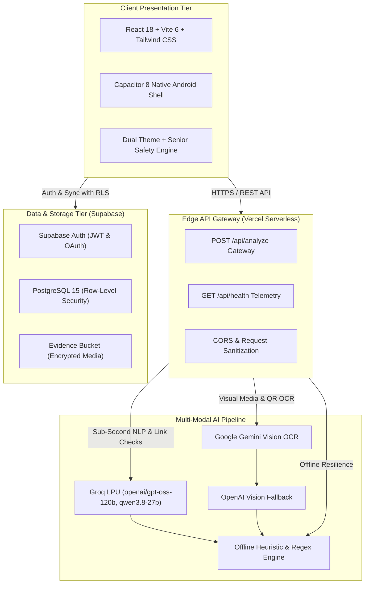

# GhostNet AI

**See the scam before it sees you.**

An AI-powered multi-modal cybersecurity and digital safety platform that detects, explains, and helps users respond to suspicious messages, deceptive links, screenshots, and community scam threats in real-time.

[](LICENSE)
[](https://react.dev)
[](https://vitejs.dev)
[](https://tailwindcss.com)
[](https://supabase.com)
[](https://vercel.com)
[](https://capacitorjs.com)

---

## 📌 Executive Summary

Digital fraud and social-engineering scams cause over **$10B in annual losses globally**. Modern attackers increasingly use automated AI to craft realistic bank alerts, fake UPI cashback requests, and deceptive lookalike portals. 

**GhostNet AI** acts as an autonomous digital defense layer. Instead of providing black-box percentage scores, GhostNet performs **Threat Reconstruction™**, visually mapping the attacker's step-by-step kill-chain and explaining *why* a message is dangerous, *what* the fraudster is trying to accomplish, and *how* to safely respond.

---

## ✨ Key Capabilities

| Capability | Description | Status |
| :--- | :--- | :---: |
| **Message & Smishing Scanner** | Evaluates SMS, WhatsApp, and email text for urgency manipulation, coercion, and credential harvesting. | ✅ Implemented |
| **Link & Domain Trust Inspector** | Decomposes URLs, domain age, SSL status, Punycode, and typosquatting brand mimicry. | ✅ Implemented |
| **Vision Screenshot Scanner** | Multi-modal OCR analyzing fake payment receipts, banking portal replicas, and QR code traps. | ✅ Implemented |
| **GhostNet Threat Reconstruction™** | Maps user evidence into an interactive 5-stage attack kill-chain (*Ingress* ➔ *Social Engineering* ➔ *Phishing Gateway* ➔ *Credential Harvesting* ➔ *Loss*). | ✅ Implemented |
| **"What Happens If I Click?" Sandbox** | Zero-execution educational simulation modal showing how phishing portals exploit victims without executing hostile code. | ✅ Implemented |
| **Attacker Intent Engine** | Translates technical threat vectors into plain-English attacker objectives. | ✅ Implemented |
| **Family & Senior Safety Mode** | High-contrast accessibility mode with enlarged touch targets and simplified safety guidance for non-technical users. | ✅ Implemented |
| **Theme Engine** | Instant Light / Dark theme switching with persistent local storage. | ✅ Implemented |
| **Global Scam Heatmap & Radar** | Telemetry dashboard mapping geographic threat clusters across major urban nodes. | ✅ Implemented |
| **Incident Response Protocol** | One-tap containment checklist (STOP, VERIFY with National Cyber Helpline 1930, REPORT, SECURE). | ✅ Implemented |
| **Cross-Platform Android Mobile** | Native Android package configured via Capacitor 8. | ✅ Implemented |

---

## 🏛️ System Architecture



---

## ⚡ Quickstart & Local Development

### 1. Prerequisites
* **Node.js:** v18.0.0+ (v20+ recommended)
* **npm:** v9.0.0+

### 2. Setup
```bash
# Clone the repository
git clone https://github.com/ImperialCoder01/GhostNet.git
cd GhostNet/GhostNet-app/GhostNet-app

# Install dependencies
npm install

# Configure environment variables
cp .env.example .env.local
```

### 3. Environment Variables (`.env.local`)
```env
# Supabase Configuration (Required)
VITE_SUPABASE_URL=https://your-project.supabase.co
VITE_SUPABASE_ANON_KEY=your_supabase_anon_key

# AI Engine - Serverless Edge Secrets (api/analyze.js)
GROQ_API_KEY=your_groq_api_key
GEMINI_API_KEY=your_gemini_api_key
# OPENAI_API_KEY=your_openai_api_key (optional)
```

### 4. Run Development Server
```bash
npm run dev
```
Open [http://localhost:5173](http://localhost:5173) in your browser.

### 5. Run Automated Tests
```bash
npm test
```

---

## 📱 Mobile Build (Android)

GhostNet is packaged for Android via **Capacitor 8**:

```bash
# Build production web bundle
npm run build

# Sync assets to native Android project
npx cap sync android

# Open Android Studio to build APK
npx cap open android
```

---

## 📚 Technical Documentation Index

Detailed architectural, security, and developer specifications are organized in the [`docs/`](docs/) directory:

| Document | Description |
| :--- | :--- |
| [**Architecture**](docs/ARCHITECTURE.md) | Complete component hierarchy, data flows, and edge gateway design. |
| [**AI Architecture**](docs/AI_ARCHITECTURE.md) | Multi-model routing, prompt engineering, risk scoring vs confidence, and OCR pipeline. |
| [**API Reference**](docs/API.md) | Full endpoint specification for `/api/analyze` across all scan types. |
| [**Database & Schema**](docs/DATABASE.md) | PostgreSQL schema, Row-Level Security (RLS) policies, and Supabase Storage rules. |
| [**Security Architecture**](docs/SECURITY.md) | Secret isolation, SSRF defenses, upload validations, and disclosure SLA. |
| [**Threat Model**](docs/THREAT_MODEL.md) | Formal threat analysis covering prompt injection, SSRF, IDOR, and mitigations. |
| [**Privacy Policy**](docs/PRIVACY.md) | Data minimization, ephemeral processing, zero-ad tracking pledge, and data purge. |
| [**Deployment Guide**](docs/DEPLOYMENT.md) | Instructions for Vercel production deployment and Supabase migrations. |
| [**Mobile Guide**](docs/MOBILE.md) | Capacitor Android setup, permissions, and APK compilation. |
| [**Testing Strategy**](docs/TESTING.md) | Unit test matrix, automated test runners, and manual QA checklists. |
| [**Decision Log (ADR)**](docs/DECISION_LOG.md) | Architectural Decision Records explaining key technology choices. |
| [**Hackathon Demo Guide**](docs/DEMO_GUIDE.md) | 3–5 minute step-by-step presentation script with sample inputs and fallback scenarios. |
| [**Hackathon Pitch**](docs/HACKATHON_PITCH.md) | Problem statement, value proposition, competitive differentiation, and impact. |
| [**Product Roadmap**](docs/ROADMAP.md) | Completed milestones, near-term features, and long-term research vision. |

---

## ⚠️ Limitations & Responsible Use

1. **Probabilistic Risk Estimation:** Risk scores and threat reconstructions are probabilistic machine-learning and heuristic estimates based on provided semantic signals. They are intended for decision support and digital awareness, not as legal or financial guarantees.
2. **External AI Availability:** Cloud AI inferences depend on third-party provider availability (Groq, Google Gemini). GhostNet includes an autonomous local heuristic engine to ensure offline continuity during provider rate limits.
3. **No Active Exploitation:** GhostNet does not execute hostile payloads or interact with attackers. All threat simulations are safe, static educational walkthroughs.

---

## 🤝 Contributing

We welcome community contributions! Please review our [Contributing Guide](CONTRIBUTING.md) and [Code of Conduct](CODE_OF_CONDUCT.md) before submitting a Pull Request.

---

## 📄 License

GhostNet AI is open-source software licensed under the [MIT License](LICENSE).
