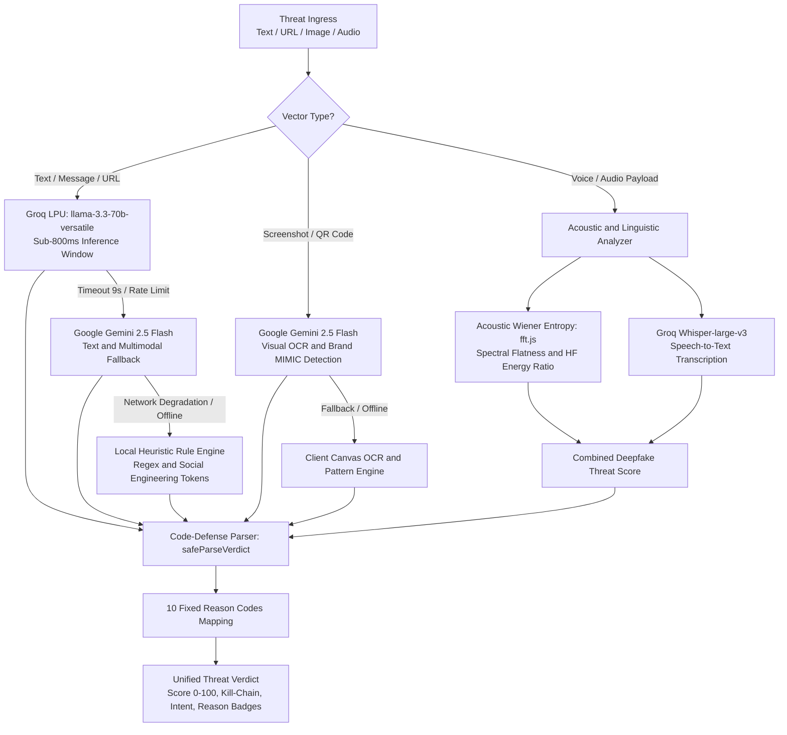

# AI Architecture & Multi-Modal Threat Pipeline

## 1. Multi-Modal Pipeline Overview

GhostNet AI operates a multi-modal artificial intelligence pipeline designed to inspect, score, explain, and reconstruct cyber threats across five distinct attack surfaces:

1. **Natural Language Messages:** SMS smishing, WhatsApp lures, Telegram extortion, and spear-phishing emails.
2. **Hyperlinks & Lookalike Domains:** Typosquatting URLs, brand lookalikes, IP-literal URLs, and obfuscated redirect gateways.
3. **Screenshots & Visual Evidence:** Fake banking portals, counterfeit payment receipts, and QR code phishing traps.
4. **Synthetic Audio & Voice Calls:** Deepfake audio impersonation, AI voice cloning, and robotic IVR fraud calls.
5. **Decentralized Threat Indicators:** Community threat telemetry and synchronized global blocklists.

---

## 2. Multi-Model Inference Cascade & Failover

GhostNet guarantees high availability and zero downtime through a tiered cascade:



---

## 3. Explainable Risk Scoring & Reason Codes Defense

Traditional machine learning classifiers suffer from opaque confidence scores and prompt hallucination vulnerabilities. GhostNet enforces strict explainability through **10 Standardized Reason Codes**:

| Reason Code | Category | Plain-English Detection Criterion |
|:---|:---|:---|
| `URGENCY_SCARE_TACTICS` | Psychological Manipulation | Threatening account closure, power disconnection, or immediate legal action within short deadlines (e.g., "within 24 hours"). |
| `REQUEST_OTP_PASSWORD` | Credential Harvesting | Explicit solicitation of One-Time Passwords (OTPs), PINs, passwords, or CVVs. |
| `PAYMENT_REDIRECT` | Financial Coercion | Directing users to unauthorized payment gateways, gift card purchases, or reverse UPI collect requests. |
| `SUSPICIOUS_DOMAIN` | Infrastructure Deception | Lookalike domains, typosquats, newly registered domains, Punycode, or raw IP addresses (`http://192.168.x.x`). |
| `IMPERSONATION_BRAND` | Identity Spoofing | Mimicking recognized financial institutions, government agencies, delivery couriers, or telecom providers. |
| `MALICIOUS_ATTACHMENT` | Malware Delivery | Unsolicited executable files, disguised APKs (`.apk`), malicious macros, or invoice scripts. |
| `UNSOLICITED_CONTACT` | Cold Ingress | Messages received from unknown numbers, international dial codes (+92, +234), or non-consensual channels. |
| `POOR_GRAMMAR_FORMAT` | Formatting Anomaly | Glaring grammatical errors, awkward machine translations, irregular capitalization, or zero-width character obfuscation. |
| `REWARD_BAIT` | Incentive Lure | Fabricated lottery prizes, unrequested cashback, part-time YouTube review jobs, or crypto investment windfalls. |
| `THREAT_BLACKMAIL` | Sextortion / Intimidation | Accusations of illicit activities, fabricated webcam recordings, or ransomware extortion. |

### Code-Defense Parsing (`safeParseVerdict`)
All LLM responses pass through `safeParseVerdict()`:
1. Strips markdown code fences (` ```json ... ``` `).
2. Parses raw JSON strictly.
3. Filters the `reasonCodes` array against an immutable set of the 10 authorized reason codes.
4. Drops any hallucinated or arbitrary tokens, ensuring deterministic downstream rendering.

---

## 4. Acoustic Wiener Spectral Flatness Engine

For synthetic call and voice scam detection, GhostNet utilizes a hybrid acoustic-linguistic engine:

### A. Acoustic Spectral Analysis (`src/lib/spectralFeatures.js`)
* Uses `fft.js` to perform an in-memory 512-point Fast Fourier Transform on 16kHz PCM audio waveforms.
* **Spectral Flatness (Wiener Entropy):** Ratio of the geometric mean to the arithmetic mean of the power spectrum:
  $$\text{Flatness} = \frac{\exp\left(\frac{1}{N} \sum_{k=0}^{N-1} \ln S(k)\right)}{\frac{1}{N} \sum_{k=0}^{N-1} S(k)}$$
* Human biological vocal tract resonances create distinct harmonic formant peaks (lower spectral flatness ~0.1 - 0.35).
* Neural vocoders and synthetic text-to-speech generators exhibit higher high-frequency noise and flattened distributions (>0.45), indicating synthetic or voice-cloned origins.
* Additional extracted features: **Zero-Crossing Rate (ZCR)**, **High-Frequency Energy Ratio**, and **Pitch Jitter Variance**.

### B. Linguistic Social Engineering Analysis
* Transcribes audio in real-time via Groq Whisper-large-v3.
* Scans the transcribed text for high-pressure extortion keywords (e.g., "digital arrest", "customs detention", "verify OTP").
* Combines acoustic synthetic probability (40% weight) with linguistic threat severity (60% weight).

---

## 5. Threat Reconstruction™ (5-Stage Cyber Kill-Chain)

GhostNet contextualizes every attack into an interactive 5-stage progression:

```
[1. Ingress Vector]
      │ (Unsolicited SMS, WhatsApp message, cold IVR call)
      ▼
[2. Social Engineering Pretext]
      │ (Urgent bank KYC expiration, electricity disconnection panic)
      ▼
[3. Phishing / Trap Gateway]
      │ (Typosquatting link, QR code trap, APK download)
      ▼
[4. Credential Harvesting]
      │ (Fake NetBanking portal, OTP interception form)
      ▼
[5. Loss & Impact]
      │ (Unauthorized UPI fund transfer, account takeover, identity theft)
```

---

## 6. Attacker Intent Inference Taxonomy

The Attacker Intent Engine translates technical markers into plain-English adversary motivations:

* **Financial Extraction:** Unauthorized fund transfers via reverse UPI collect requests or credit card fraud.
* **Credential Harvesting:** Stealing authentication secrets (passwords, PINs, OTPs) for downstream account takeovers.
* **Identity Impersonation:** Collecting government ID numbers (Aadhaar, PAN, SSN) to facilitate synthetic identity theft.
* **Device Compromise:** Coercing victims to download hostile APKs or remote access tools (AnyDesk, TeamViewer).
* **Extortion / Blackmail:** Pressuring victims into cryptocurrency transfers under duress or fabricated legal accusations.
