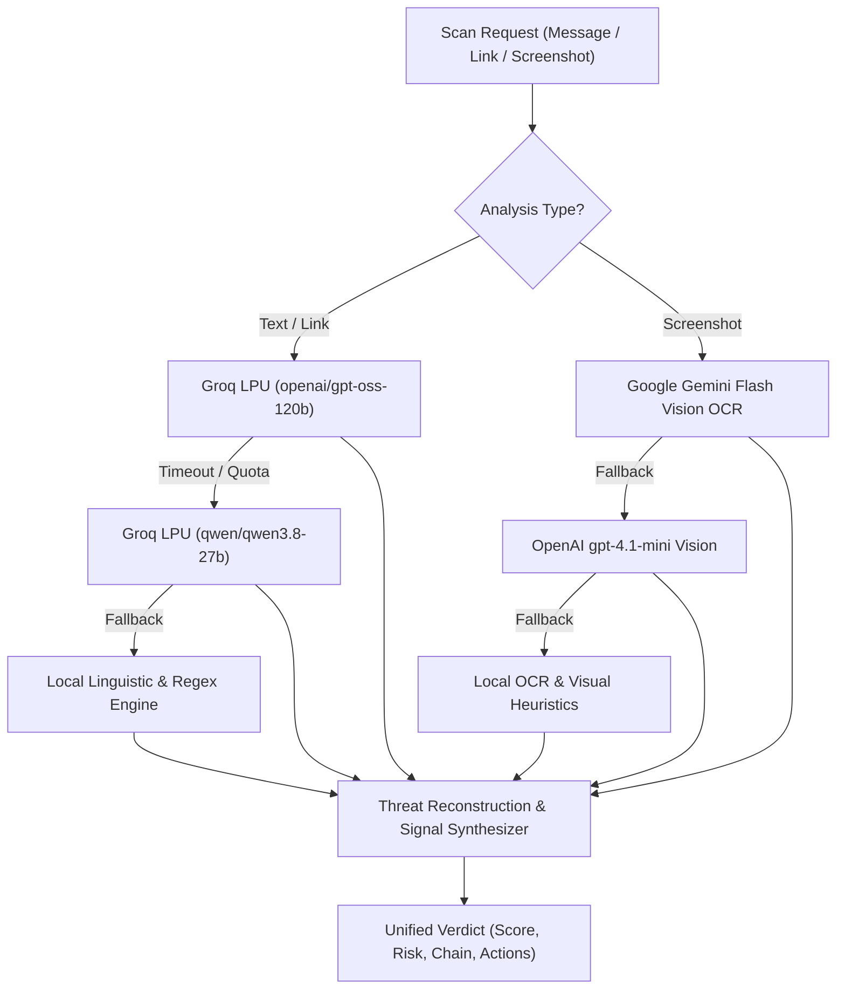

# AI Architecture & Threat Modeling Pipeline

## 1. Overview of the AI Pipeline

GhostNet AI employs a multi-tiered, multi-modal artificial intelligence pipeline designed to inspect, score, and reconstruct cyber threats across four distinct vectors:

1. **Natural Language Messages:** SMS, WhatsApp, Telegram, and Phishing Emails.
2. **Hyperlinks & Domains:** Typosquatting URLs, brand lookalikes, and deceptive redirect gateways.
3. **Screenshots & Visual Media:** Fake payment receipts, cloned banking portals, and fraudulent QR codes.
4. **Community Scam Reports:** Crowdsourced threat submissions and deduplication matching.

---

## 2. Multi-Model Inference & Fallback Chain

---

## 3. Risk Score vs. Model Confidence

GhostNet explicitly distinguishes between **Risk Score** and **Model Confidence**:

* **Risk Score (0–100):** Represents the estimated severity and presence of malicious social engineering, credential harvesting, or financial fraud indicators in the payload.
  * `0 – 34`: **Safe / Low Risk** (no malicious indicators detected).
  * `35 – 69`: **Suspicious / Elevated Risk** (coercive, urgent, or unverified patterns).
  * `70 – 100`: **High Threat Scam** (explicit phishing, lookalike branding, or fraudulent payment trap).

* **Model Confidence (`high` | `medium` | `low`):** Represents the certainty level of the AI models given the clarity and volume of evidence provided in the user input.

> **Technical Disclosure:** Risk scores are calculated heuristic and LLM probability estimates based on extracted semantic signals. They are intended for decision-support and awareness, not as absolute mathematical certainty.

---

## 4. Threat Reconstruction™ (5-Stage Kill Chain)

Instead of outputting a generic black-box score, GhostNet reconstructs the attack sequence into an actionable 5-stage progression:

1. **Stage 1 — Ingress Vector:** How the attacker initiates contact (unsolicited SMS, WhatsApp invite, spoofed email).
2. **Stage 2 — Social Engineering Cue:** The psychological trigger utilized (time urgency, bank account suspension panic, lottery euphoria).
3. **Stage 3 — Phishing / Trap Gateway:** The mechanism used to redirect the victim (lookalike URL, shortened hyperlink, fake APK download).
4. **Stage 4 — Credential Harvesting:** The data collection phase (fake NetBanking login, debit card CVV prompt, secret OTP request).
5. **Stage 5 — Financial Impact & Loss:** The final objective (unauthorized UPI debit, account takeover, identity theft).

---

## 5. Attacker Intent Inference

GhostNet evaluates the underlying objective of the attacker and translates it into plain English for the user (e.g., *"Attacker is attempting to initiate a reverse UPI collect request to drain funds from your linked bank account"*).
