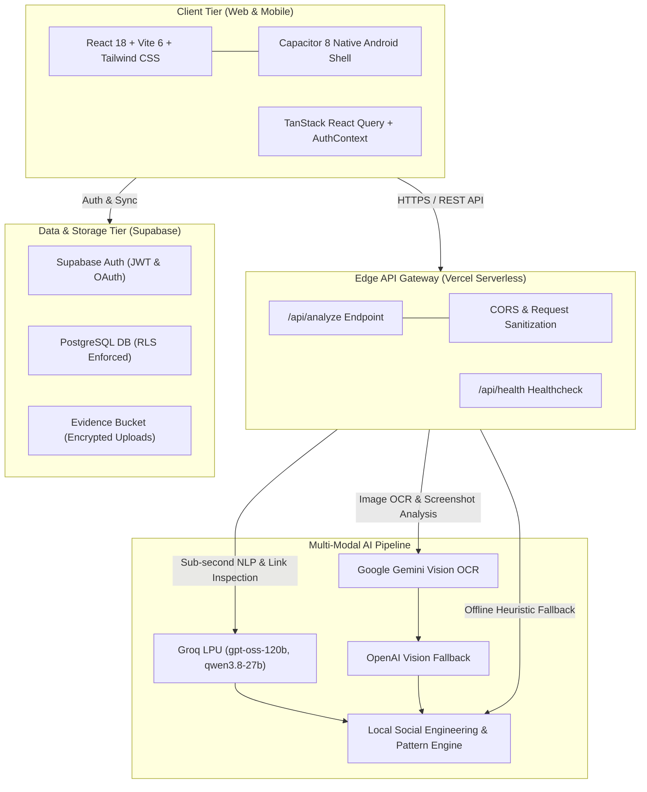
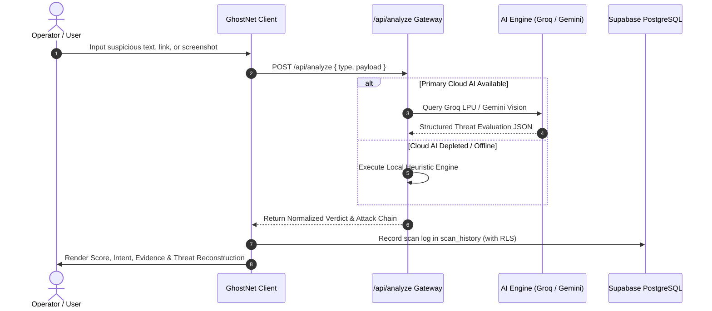

# System Architecture & Technical Design

## 1. High-Level Architecture Overview

GhostNet AI is engineered as a cross-platform, multi-modal cyber threat detection and digital safety system. It operates on a tiered defense model separating client interaction, edge API gateway evaluation, multi-model AI routing, and encrypted database persistence with Row-Level Security.

---

## 2. Component Layers & Responsibilities

### A. Frontend Presentation Layer
* **Stack:** React 18, Vite 6, Tailwind CSS, Lucide React, Framer Motion, Recharts.
* **Responsibilities:**
  * Real-time client-side input validation and payload structuring.
  * Interactive **Threat Reconstruction (Kill-Chain)** visualization.
  * Educational **"What Happens If I Click?" Safe Threat Sandbox**.
  * Dynamic Light and Dark theme switching with persistent local storage.
  * Dedicated **Family & Senior Safety Mode** for non-technical users.

### B. API Gateway Tier (`/api/analyze.js`)
* **Runtime:** Vercel Edge Serverless Function (Node.js runtime).
* **Responsibilities:**
  * Secure server-side isolation of all AI credentials (`GROQ_API_KEY`, `GEMINI_API_KEY`, `OPENAI_API_KEY`).
  * Request payload normalization (message text, link URLs, screenshot URLs, community reports).
  * Enforcing security headers (`X-Content-Type-Options: nosniff`, `X-Frame-Options: DENY`, `Referrer-Policy: no-referrer`).
  * Coordinating autonomous model fallback upon latency spikes or quota depletion.

### C. Multi-Modal AI Engine Tier
* **Text & Link Intelligence:** Groq LPU processing structured JSON prompts in sub-second inference windows.
* **Screenshot Vision Engine:** Gemini Vision OCR extracting visual text, detecting brand impersonation logos, and analyzing payment QR trap vectors.
* **Local Heuristic Engine:** Offline rule engine evaluating 30+ linguistic urgency tokens, Punycode, typosquatting distance, and credential harvesting patterns.

### D. Data & Storage Tier (Supabase)
* **PostgreSQL:** Stores `scan_history` and `scam_reports` with strict PostgreSQL Row-Level Security (RLS) guaranteeing user data partition.
* **Evidence Storage:** Encrypted `evidence` bucket for screenshot uploads with authenticated access policies.

---

## 3. End-to-End Data Flow

