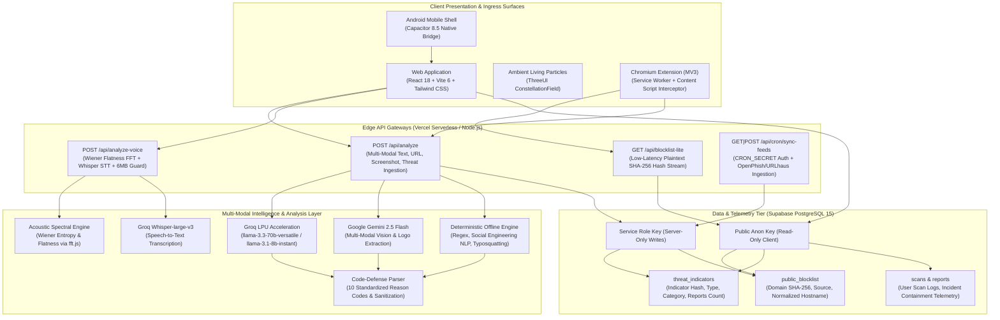
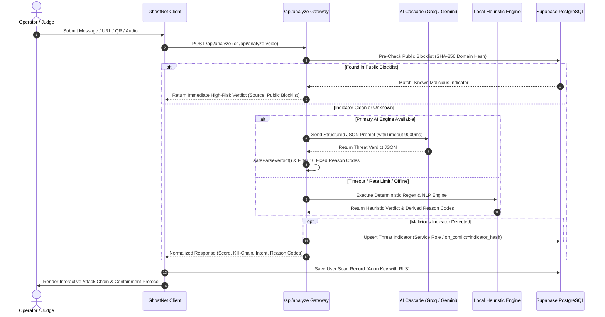

# System Architecture & Technical Design

## 1. High-Level Architecture Overview

GhostNet AI is an enterprise-grade, multi-modal cybersecurity and digital fraud prevention platform. Engineered with a defense-in-depth architecture, GhostNet spans web, mobile, and browser extension surfaces, backed by serverless edge microservices, a multi-model AI inference pipeline with acoustic spectral analysis, and a real-time PostgreSQL database with strict Row-Level Security (RLS).



---

## 2. Component Layers & Engineering Specifications

### A. Presentation & Ingress Layer
* **Frontend Architecture:** React 18, Vite 6, Tailwind CSS 3.4, Lucide React, Framer Motion, Recharts.
* **Ambient Three.js Shaders:** Integrated ThreeUI `ConstellationField` ("particle-drift" mode) provides dynamic living telemetry feedback across both Dark and Light themes.
* **Accessibility Architecture:**
  * Instant Dark/Light theme switching with CSS custom properties and persistent localStorage state.
  * **Senior & Family Safety Mode**: Enlarges typography, magnifies touch targets, and converts technical cyber indicators into clear, actionable advice.
* **Judge / Guest Access:** One-click `AuthGate` demo bypass (`⚡ Explore as Guest / Judge Demo Mode`) allowing immediate evaluation without requiring active Supabase credentials.

### B. Edge Serverless Gateways
Hosted on Vercel Serverless (Node.js runtime) with strict edge security policies:
1. **`POST /api/analyze`**:
   * Multi-modal ingestion of messages, links, screenshots, and community threat reports.
   * Enforces `withTimeout(promise, 9000)` fail-safe execution to eliminate hanging serverless functions.
   * Implements `safeParseVerdict()` to extract and validate JSON responses from LLM markdown code blocks.
   * Sanitizes reason codes against a fixed whitelist of 10 standardized threat codes.
   * Employs Supabase read/write key separation: uses the public anonymous key for read operations and reserves `SUPABASE_SERVICE_ROLE_KEY` strictly for indicator ingestion.
2. **`POST /api/analyze-voice`**:
   * Accepts base64-encoded audio payloads with a strict HTTP 413 guard rejecting requests >6MB.
   * Calculates spectral flatness (Wiener entropy), high-frequency energy ratio, zero-crossing rate, and jitter variance.
   * Transcribes audio using Groq Whisper-large-v3 to detect linguistic social engineering vectors.
   * Combines acoustic synthetic anomalies with linguistic risk signals for unified scoring.
3. **`GET /api/blocklist-lite`**:
   * Ultra-low-latency endpoint streaming normalized SHA-256 domain hashes to the browser extension.
   * Operates via public anonymous Supabase client with zero server overhead.
4. **`GET|POST /api/cron/sync-feeds`**:
   * Automated scheduled background worker fetching live malicious URLs from OpenPhish and URLhaus feeds.
   * Protected by HTTP Bearer token validation matching `CRON_SECRET`.
   * Scheduled at `0 0 * * *` (once daily) for 100% compliance with Vercel Hobby plan tier limits.

### C. Multi-Modal Intelligence Tier
* **Sub-Second NLP (Groq LPU):** `llama-3.3-70b-versatile` and `llama-3.1-8b-instant` provide structured semantic evaluation in <800ms.
* **Vision OCR (Google Gemini):** `gemini-2.5-flash` analyzes screenshot evidence, identifying visual brand mimicry, fake payment receipts, and QR code traps.
* **Acoustic Wiener Entropy (`fft.js`):** In-memory spectral FFT decomposes raw audio waveforms into frequency buckets. Synthetic AI vocoders and cloned voices exhibit distinct spectral flatness and harmonic anomalies compared to human biological speech.
* **Deterministic Offline Fallback:** When external AI APIs or networks are unreachable, an autonomous local regex and NLP heuristic engine computes threat scores and populates reason codes with zero downtime.

### D. Data & Intelligence Persistence (Supabase)
* **PostgreSQL 15:** Enforces PostgreSQL Row-Level Security (RLS) across all user tables.
* **Threat Indicators Table (`threat_indicators`):** Stores SHA-256 hashed scam indicators (domains, phone numbers, UPI IDs, QR payloads) with report count tracking and category indexing. PostgREST upsert is secured via `on_conflict=indicator_hash`.
* **Public Blocklist Table (`public_blocklist`):** Stores synced threat intelligence from OpenPhish and URLhaus with SHA-256 domain hashes for rapid O(1) indexed lookups.

### E. Client-Side Edge Defense (Chrome Extension MV3)
* **Manifest V3 Architecture:** Background service worker (`background.js`), pre-click DOM content script (`content.js`), and popup interface (`popup.html`).
* **Pre-Click Interception:** Evaluates destination links on hover and click against the local blocklist cache. Suspicious navigations are halted and redirected to an educational interstitial (`warning.html`).

---

## 3. End-to-End Threat Analysis Flow



---

## 4. Hardware Permissions & Edge Security Posture

GhostNet configures enterprise-grade security headers across all edge responses via `vercel.json`:

```json
{
  "headers": [
    {
      "source": "/(.*)",
      "headers": [
        { "key": "X-Content-Type-Options", "value": "nosniff" },
        { "key": "X-Frame-Options", "value": "SAMEORIGIN" },
        { "key": "Referrer-Policy", "value": "strict-origin-when-cross-origin" },
        { "key": "Permissions-Policy", "value": "camera=(self), microphone=(self), geolocation=()" }
      ]
    }
  ]
}
```

* **`camera=(self)`**: Authorizes HTML5 video streaming for live QR code scanning on the primary origin.
* **`microphone=(self)`**: Authorizes Web Audio API recording for real-time deepfake call analysis.
* **`geolocation=()`**: Explicitly denies geolocation access to preserve operator anonymity.
