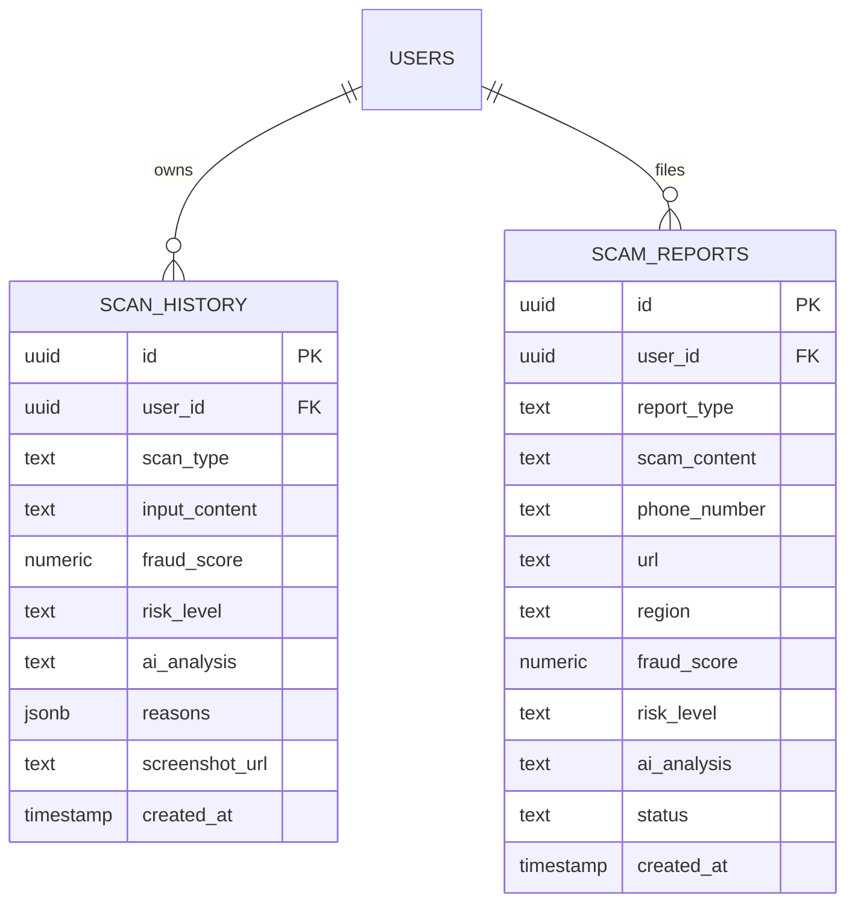

# Database Architecture & PostgreSQL Schema

GhostNet AI uses **Supabase (PostgreSQL 15+)** for relational data persistence, user authentication, and encrypted evidence storage.

---

## 1. Database Schema & Tables



---

## 2. PostgreSQL Row-Level Security (RLS)

PostgreSQL Row-Level Security ensures strict cryptographic isolation between user accounts:

### Table: `scan_history`
```sql
ALTER TABLE scan_history ENABLE ROW LEVEL SECURITY;

-- Users can only read their own private scan records
CREATE POLICY "Users read own scans"
ON scan_history FOR SELECT
USING (auth.uid() = user_id);

-- Users can only insert their own scan records
CREATE POLICY "Users insert own scans"
ON scan_history FOR INSERT
WITH CHECK (auth.uid() = user_id);

-- Users can permanently delete their own scan records
CREATE POLICY "Users delete own scans"
ON scan_history FOR DELETE
USING (auth.uid() = user_id);
```

### Table: `scam_reports`
```sql
ALTER TABLE scam_reports ENABLE ROW LEVEL SECURITY;

-- Verified scam reports are readable by all authenticated users for community defense
CREATE POLICY "Community reads reports"
ON scam_reports FOR SELECT
TO authenticated, anon
USING (true);

-- Authenticated users can submit new scam reports
CREATE POLICY "Users submit reports"
ON scam_reports FOR INSERT
WITH CHECK (auth.uid() = user_id OR user_id IS NULL);
```

---

## 3. Storage Buckets

* **Bucket Name:** `evidence`
* **Access Level:** Public read with authenticated upload policies.
* **MIME Constraints:** `image/png`, `image/jpeg`, `image/webp`.
* **Size Constraint:** 10 MB per file.
