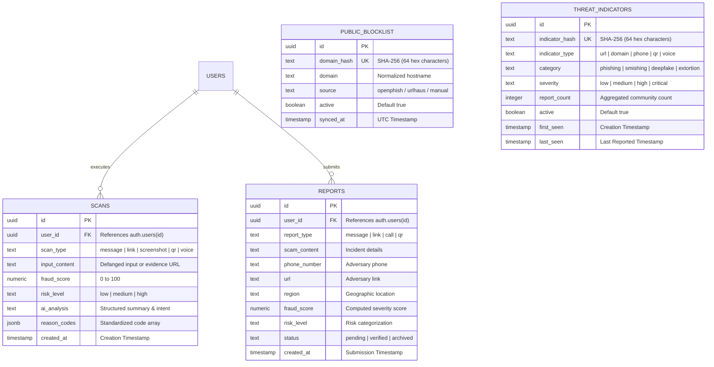

# Database Architecture & PostgreSQL Schema

GhostNet AI utilizes **Supabase (PostgreSQL 15+)** for relational data persistence, community threat syndication, public blocklist caching, user authentication, and encrypted evidence storage.

---

## 1. Relational Entity-Relationship Diagram



---

## 2. Table Schemas & Definitions

### A. `public_blocklist` (Feature 3: Feed Integration)
Stores synchronized malicious domain hashes ingested from OpenPhish and URLhaus feeds.

```sql
CREATE TABLE IF NOT EXISTS public.public_blocklist (
    id UUID PRIMARY KEY DEFAULT gen_random_uuid(),
    domain_hash TEXT UNIQUE NOT NULL,
    domain TEXT NOT NULL,
    source TEXT NOT NULL,
    active BOOLEAN DEFAULT true NOT NULL,
    synced_at TIMESTAMPTZ DEFAULT now() NOT NULL
);

-- B-tree index for O(1) domain hash queries
CREATE INDEX IF NOT EXISTS idx_public_blocklist_hash
ON public.public_blocklist (domain_hash);
```

### B. `threat_indicators` (Feature 4: Community Intelligence)
Aggregates community reports and automated scan detections into a decentralized threat telemetry database.

```sql
CREATE TABLE IF NOT EXISTS public.threat_indicators (
    id UUID PRIMARY KEY DEFAULT gen_random_uuid(),
    indicator_hash TEXT UNIQUE NOT NULL,
    indicator_type TEXT NOT NULL CHECK (indicator_type IN ('url', 'domain', 'phone', 'qr', 'voice')),
    category TEXT NOT NULL DEFAULT 'phishing',
    severity TEXT NOT NULL DEFAULT 'high',
    first_seen TIMESTAMPTZ DEFAULT now() NOT NULL,
    last_seen TIMESTAMPTZ DEFAULT now() NOT NULL,
    report_count INTEGER DEFAULT 1 NOT NULL,
    active BOOLEAN DEFAULT true NOT NULL
);

-- Performance indexes for lookup and real-time heatmap filtering
CREATE INDEX IF NOT EXISTS idx_threat_indicators_hash
ON public.threat_indicators (indicator_hash);

CREATE INDEX IF NOT EXISTS idx_threat_indicators_type_active
ON public.threat_indicators (indicator_type, active);
```

### C. `scans` (Operator Activity Logs)
Stores historical scan logs private to each authenticated user session.

```sql
CREATE TABLE IF NOT EXISTS public.scans (
    id UUID PRIMARY KEY DEFAULT gen_random_uuid(),
    user_id UUID REFERENCES auth.users(id) ON DELETE CASCADE,
    scan_type TEXT NOT NULL,
    input_content TEXT,
    fraud_score NUMERIC(5,2),
    risk_level TEXT,
    ai_analysis TEXT,
    reason_codes JSONB DEFAULT '[]'::jsonb,
    screenshot_url TEXT,
    created_at TIMESTAMPTZ DEFAULT now() NOT NULL
);
```

### D. `reports` (Community Incident Reporting)
Stores user-submitted scam incident disclosures for threat syndicate tracking.

```sql
CREATE TABLE IF NOT EXISTS public.reports (
    id UUID PRIMARY KEY DEFAULT gen_random_uuid(),
    user_id UUID REFERENCES auth.users(id) ON DELETE SET NULL,
    report_type TEXT NOT NULL,
    scam_content TEXT NOT NULL,
    phone_number TEXT,
    url TEXT,
    region TEXT,
    fraud_score NUMERIC(5,2),
    risk_level TEXT,
    status TEXT DEFAULT 'verified' NOT NULL,
    created_at TIMESTAMPTZ DEFAULT now() NOT NULL
);
```

---

## 3. Row-Level Security (RLS) & Key Separation

GhostNet strictly enforces the **Principle of Least Privilege**:
* **Public Anonymous Key (`VITE_SUPABASE_ANON_KEY`)**: Used by frontend clients and serverless read endpoints. Authorized to read active threat telemetry and public blocklists, and manage private user scans.
* **Service Role Key (`SUPABASE_SERVICE_ROLE_KEY`)**: Server-side secret used exclusively by `/api/analyze` and `/api/cron/sync-feeds` to upsert indicators and sync feeds. NEVER leaked to the client.

### RLS Policies

```sql
-- Enable RLS across all tables
ALTER TABLE public.public_blocklist ENABLE ROW LEVEL SECURITY;
ALTER TABLE public.threat_indicators ENABLE ROW LEVEL SECURITY;
ALTER TABLE public.scans ENABLE ROW LEVEL SECURITY;
ALTER TABLE public.reports ENABLE ROW LEVEL SECURITY;

-- 1. public_blocklist: Public read-only
CREATE POLICY "Public read active blocklist"
ON public.public_blocklist FOR SELECT
USING (active = true);

-- 2. threat_indicators: Public read active indicators
CREATE POLICY "Public read active indicators"
ON public.threat_indicators FOR SELECT
USING (active = true);

-- 3. scans: Cryptographic user isolation
CREATE POLICY "Users read own scans"
ON public.scans FOR SELECT
USING (auth.uid() = user_id);

CREATE POLICY "Users insert own scans"
ON public.scans FOR INSERT
WITH CHECK (auth.uid() = user_id);

CREATE POLICY "Users delete own scans"
ON public.scans FOR DELETE
USING (auth.uid() = user_id);

-- 4. reports: Authenticated users can insert, all can read
CREATE POLICY "Public read verified reports"
ON public.reports FOR SELECT
USING (true);

CREATE POLICY "Authenticated users submit reports"
ON public.reports FOR INSERT
WITH CHECK (auth.uid() = user_id OR auth.uid() IS NULL);
```

---

## 4. PostgREST Upsert Handling (`on_conflict=indicator_hash`)

When the serverless gateway records a detected threat indicator, it performs an atomic upsert via PostgREST:

```http
POST /rest/v1/threat_indicators?on_conflict=indicator_hash
Prefer: resolution=merge-duplicates
```

* If the indicator does not exist: Inserts a new row with `report_count = 1`.
* If the indicator exists: Merges and increments `report_count = report_count + 1` and refreshes `last_seen = now()`.

---

## 5. Migration Index (`supabase/`)

1. [`001-initial-schema.sql`](file:///d:/LOQ/Documents/Hackathon%20Project/GhostNet%20ai/GhostNet-app/GhostNet-app/supabase/001-initial-schema.sql) — Core tables: `scans`, `reports`, user references.
2. [`002-rls-policies.sql`](file:///d:/LOQ/Documents/Hackathon%20Project/GhostNet%20ai/GhostNet-app/GhostNet-app/supabase/002-rls-policies.sql) — User data isolation and containment policies.
3. [`003-storage-buckets.sql`](file:///d:/LOQ/Documents/Hackathon%20Project/GhostNet%20ai/GhostNet-app/GhostNet-app/supabase/003-storage-buckets.sql) — Evidence upload storage bucket configuration.
4. [`004-public-blocklist.sql`](file:///d:/LOQ/Documents/Hackathon%20Project/GhostNet%20ai/GhostNet-app/GhostNet-app/supabase/004-public-blocklist.sql) — Feature 3: `public_blocklist` table and indexes.
5. [`005-threat-indicators.sql`](file:///d:/LOQ/Documents/Hackathon%20Project/GhostNet%20ai/GhostNet-app/GhostNet-app/supabase/005-threat-indicators.sql) — Feature 4: `threat_indicators` schema, indicators type constraints ('url', 'domain', 'phone', 'qr', 'voice').
6. [`006-consolidated-audit-repairs.sql`](file:///d:/LOQ/Documents/Hackathon%20Project/GhostNet%20ai/GhostNet-app/GhostNet-app/supabase/006-consolidated-audit-repairs.sql) — 1-click idempotent consolidation script applying all schema migrations.
