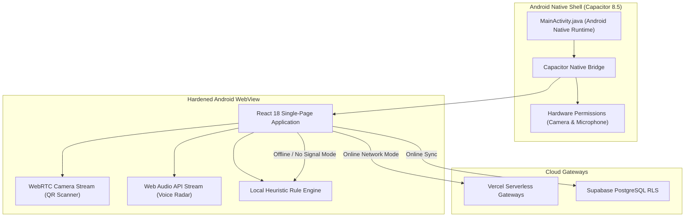

# Mobile Architecture & Capacitor Android Guide

GhostNet AI provides native cross-platform Android distribution powered by **Capacitor 8.5**, wrapping the production-optimized Vite React web application inside a hardened native WebView runtime.

---

## 1. Native Mobile Architecture



* **Package Identifier:** `com.ghostnet.app`
* **Target SDK:** Android 34 (Android 14)
* **Minimum SDK:** Android 22 (Android 5.1 Lollipop)
* **Web Build Directory:** `dist/`

---

## 2. Hardware Permissions (`AndroidManifest.xml`)

Located at `android/app/src/main/AndroidManifest.xml`:

```xml
<!-- Hardware Camera Access for Real-Time QR Phishing Inspection -->
<uses-permission android:name="android.permission.CAMERA" />
<uses-feature android:name="android.hardware.camera" android:required="false" />

<!-- Microphone Access for Live Voice Call & Deepfake Audio Analysis -->
<uses-permission android:name="android.permission.RECORD_AUDIO" />
<uses-permission android:name="android.permission.MODIFY_AUDIO_SETTINGS" />

<!-- Network Connectivity for Cloud AI Gateways & Threat Synchronization -->
<uses-permission android:name="android.permission.INTERNET" />
<uses-permission android:name="android.permission.ACCESS_NETWORK_STATE" />
```

* Permissions are requested dynamically in-app when the user initiates a QR camera scan or begins audio recording.
* If camera or microphone access is denied by the user, the app automatically presents safe manual upload fallbacks (e.g., photo file selector or audio upload).

---

## 3. Mobile Touch & Accessibility Optimizations

* **Senior & Family Safety Mode**: On mobile screens, activating Senior Mode enlarges touch targets to a minimum of **48x48dp**, increases font sizes by 25%, and simplifies technical cybersecurity reports into plain-English advice.
* **Responsive Command Center**: Side navigation drawers automatically collapse into an intuitive bottom navigation bar (`Home`, `Messages`, `Links`, `Vision`, `Radar`).
* **Zero-Signal Offline Continuity**: When users travel or lose mobile network coverage, the local heuristic engine takes over completely, scoring messages, URLs, and QR codes directly on the mobile device without network latency.

---

## 4. Compilation & Build Runbook

### Prerequisites
* **Android Studio:** Hedgehog (2023.1.1) or newer.
* **JDK:** OpenJDK 17 or OpenJDK 21.
* **Android SDK:** Platform 34 and SDK Build-Tools 34.0.0.

### Step-by-Step Compilation
```bash
# 1. Build the production React web bundle
npm run build

# 2. Sync web assets and Capacitor plugins into the Android native folder
npx cap sync android

# 3. Launch Android Studio
npx cap open android

# 4. Build Debug or Release APK
# Within Android Studio: Build ➔ Build Bundle(s) / APK(s) ➔ Build APK(s)
# Output path: android/app/build/outputs/apk/debug/app-debug.apk
```

To run directly on a connected physical Android device:
```bash
npx cap run android
```
