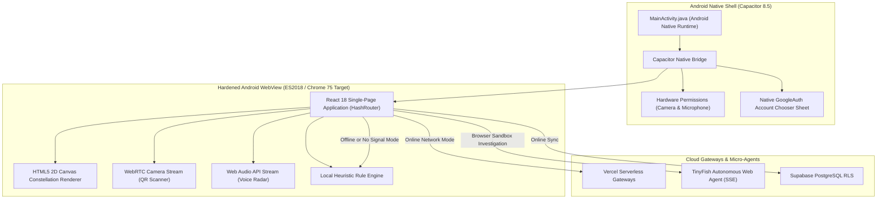

# Mobile Architecture & Capacitor Android Guide

GhostNet AI provides native cross-platform Android distribution powered by **Capacitor 8.5**, wrapping the production-optimized Vite React web application inside a hardened native WebView runtime.

---

## 1. Native Mobile Architecture


```mermaid
flowchart TD
    subgraph NativeAndroid["Android Native Shell (Capacitor 8.5)"]
        Activity["MainActivity.java (Android Native Runtime)"]
        Permissions["Hardware Permissions (Camera & Microphone)"]
        Bridge["Capacitor Native Bridge"]
        GoogleAuth["Native GoogleAuth Account Chooser Sheet"]
    end

    subgraph WebViewRuntime["Hardened Android WebView (ES2018 / Chrome 75 Target)"]
        ReactApp["React 18 Single-Page Application (HashRouter)"]
        CanvasField["HTML5 2D Canvas Constellation Renderer"]
        CameraStream["WebRTC Camera Stream (QR Scanner)"]
        AudioRecord["Web Audio API Stream (Voice Radar)"]
        OfflineEngine["Local Heuristic Rule Engine"]
    end

    subgraph BackendAPI["Cloud Gateways & Micro-Agents"]
        VercelAPI["Vercel Serverless Gateways"]
        TinyFish["TinyFish Autonomous Web Agent (SSE)"]
        SupabaseDB["Supabase PostgreSQL RLS"]
    end

    Activity --> Bridge
    Bridge --> Permissions
    Bridge --> GoogleAuth
    Bridge --> ReactApp
    ReactApp --> CanvasField
    ReactApp --> CameraStream
    ReactApp --> AudioRecord
    ReactApp --> OfflineEngine

    ReactApp -->|"Online Network Mode"| VercelAPI
    ReactApp -->|"Browser Sandbox Investigation"| TinyFish
    ReactApp -->|"Online Sync"| SupabaseDB
    ReactApp -->|"Offline or No Signal Mode"| OfflineEngine
```

* **Package Identifier:** `com.ghostnet.app`
* **Target SDK:** Android 34 (Android 14)
* **Minimum SDK:** Android 22 (Android 5.1 Lollipop)
* **Web Build Directory:** `dist/`
* **JavaScript Transpilation Target:** `es2018` / `chrome75` (ensures 100% JS compatibility on all Android System WebViews)
* **Senior Mode Integration:** Supported on Android native WebViews with 48dp+ touch targets, native Web Speech API audio playback, offline Emergency Scam Help (Helpline 1930), and native Capacitor Share Sheet integration for trusted contacts.

---

## 2. Hardware Permissions (`AndroidManifest.xml`)

Located at `android/app/src/main/AndroidManifest.xml`:

```xml
<!-- Hardware Camera Access for Real-Time QR Phishing Inspection -->
<uses-permission android:name="android.permission.CAMERA" />
<uses-feature android:name="android.hardware.camera" android:required="false" />

<!-- Microphone Access for Live Voice Call & Deepfake Audio Analysis -->
<uses-permission android:name="android.permission.RECORD_AUDIO" />
<uses-permission android:name="android.permission.MODIFY_AUDIO_SETTINGS" />

<!-- Network Connectivity for Cloud AI Gateways & Threat Synchronization -->
<uses-permission android:name="android.permission.INTERNET" />
<uses-permission android:name="android.permission.ACCESS_NETWORK_STATE" />
```

* Permissions are requested dynamically in-app when the user initiates a QR camera scan or begins audio recording.
* If camera or microphone access is denied by the user, the app automatically presents safe manual upload fallbacks (e.g., photo file selector or audio upload).

---

## 3. WebView Reliability & White-Screen Prevention

1. **JavaScript Engine Transpilation Target (`es2018` / `chrome75`)**:
   - Configured `build.target: ['chrome75', 'es2018']` and `esbuild.target: 'es2018'` in `vite.config.js`.
   - Transpiles all dependencies and application code down to ES2018 syntax, preventing `SyntaxError` crashes on older Android System WebViews.
2. **Native In-App Google Sign-In**:
   - Utilizes `@codetrix-studio/capacitor-google-auth` to launch the native Android Google Account Chooser bottom-sheet directly inside the app.
   - Eliminates external Chrome browser redirects (`signInWithRedirect`) and prevents `firebaseapp.com` invalid action errors.
   - Instantly updates React state (`setUser(userObj)`) in `AuthContext` upon account selection.
3. **Pure 2D Canvas Constellation Background**:
   - `ConstellationField.tsx` uses a native 2D Canvas renderer (`canvas.getContext("2d")`) instead of WebGL `srcDoc` iframes.
   - Eliminates WebGL context loss, iframe cross-origin `postMessage` security exceptions, and GPU rendering freezes on mobile devices.
4. **Fallback Loading Screen & Global Error Boundary**:
   - `index.html` includes an inline dark styled initializer (`<div id="root">...</div>`) and a global `window.onerror` fallback container.
   - Guarantees the user never sees a blank white screen, even during cold starts or offline network scenarios.
5. **Native HashRouter Routing**:
   - Uses `HashRouter` in `App.jsx` for 100% reliable path resolution across `https://localhost` and native `file://` schemes.

---

## 4. Mobile Touch & Accessibility Optimizations

* **Senior & Family Safety Mode**: On mobile screens, activating Senior Mode enlarges touch targets to a minimum of **48x48dp**, increases font sizes by 25%, and simplifies technical cybersecurity reports into plain-English advice.
* **Responsive Command Center**: Side navigation drawers automatically collapse into an intuitive bottom navigation bar (`Home`, `Scan`, `Threats`, `Reports`, `Settings`).
* **Zero-Signal Offline Continuity**: When users travel or lose mobile network coverage, the local heuristic engine takes over completely, scoring messages, URLs, and QR codes directly on the mobile device without network latency.

---

## 5. Pre-Built APK Release & Download

The official pre-built Android application bundle is available directly at the root of the repository:

* **Bundled APK Path:** [`GhostNet.apk`](../GhostNet.apk)
* **Direct Download Link:** [`https://github.com/ImperialCoder01/GhostNet/raw/main/GhostNet.apk`](https://github.com/ImperialCoder01/GhostNet/raw/main/GhostNet.apk)
* **APK Size:** ~13.3 MB
* **In-App Google Auth:** Native Credential Manager modal bottom-sheet via `@codetrix-studio/capacitor-google-auth`.

---

## 6. Compilation & Build Runbook

### Prerequisites
* **Android Studio:** Ladybug / Hedgehog (2024.1+) or JDK 21 (`C:\Program Files\Android\Android Studio\jbr`).
* **Android SDK:** Platform 34 and SDK Build-Tools 34.0.0.

### Step-by-Step Compilation via Terminal
```bash
# 1. Run unit & integration tests
npm test

# 2. Build the production React web bundle with ES2018 target
npm run build

# 3. Sync web assets and Capacitor plugins into the Android native folder
npx cap sync android

# 4. Build APK using terminal with JDK 21
cd android
$env:JAVA_HOME="C:\Program Files\Android\Android Studio\jbr"
.\gradlew assembleDebug

# Output location: android/app/build/outputs/apk/debug/app-debug.apk
# Copy to root:
Copy-Item -Path "app/build/outputs/apk/debug/app-debug.apk" -Destination "../../GhostNet.apk"
```

To run directly on a connected physical Android device or emulator:
```bash
npx cap run android
```
