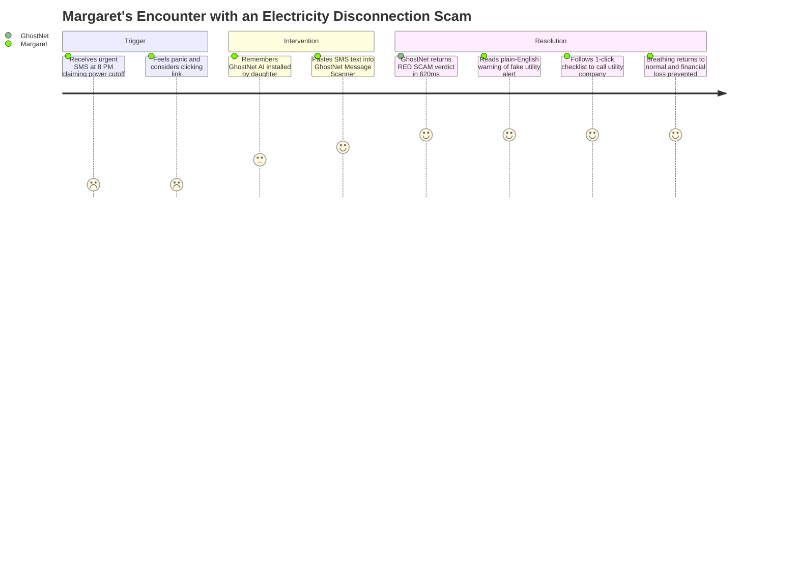
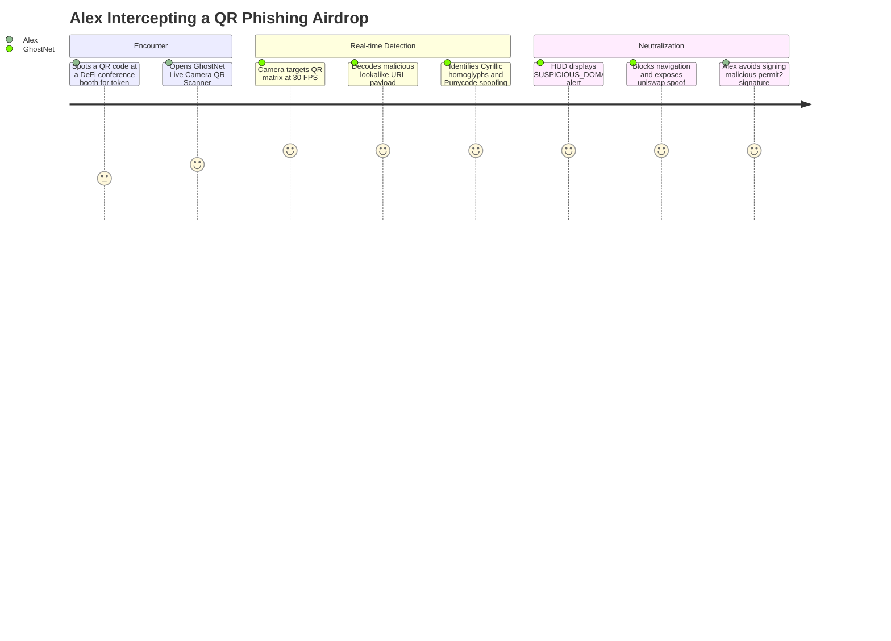
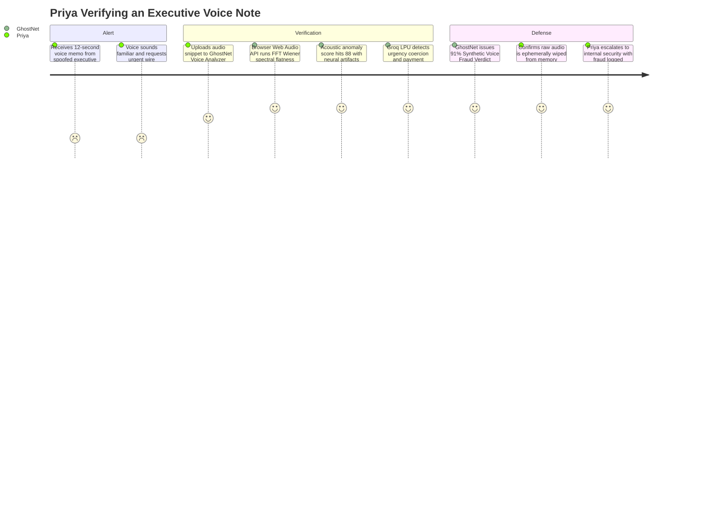
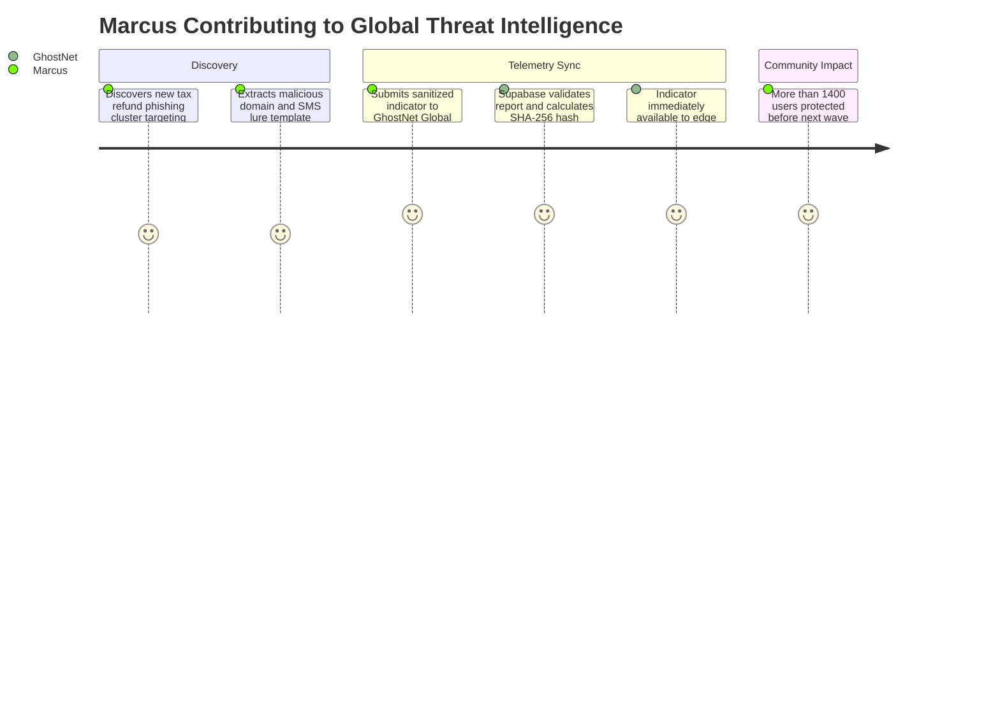

# GhostNet AI — User Personas & Customer Journeys

**Document Version:** 1.0.0-prod  
**Status:** Feature-Frozen / Hackathon Release  
**Target Release:** v1.1.0-prod  

---

## 1. Overview & Methodology

Social engineering attacks succeed because they are psychologically tailored to human emotions: **fear, urgency, greed, and authority**. To build an effective cognitive cyber shield, GhostNet AI's user experience was mapped across 4 diverse target personas representing the spectrum of digital vulnerability and cybersecurity literacy.

```
                  HIGH TECH LITERACY
                         |
      [Alex Rivera]      |      [Marcus Vance]
      Web3 / DeFi Trader |      SOC Analyst / Hunter
                         |
CONSUMER ----------------+---------------- ENTERPRISE
                         |
      [Margaret Chen]    |      [Priya Sharma]
      Retired Citizen    |      Remote Enterprise PM
                         |
                  LOW TECH LITERACY
```

---

## 2. Detailed Persona Profiles

### Persona 1: Margaret Chen (68) — The Vulnerable Senior
*“I received an SMS saying my electricity will be cut off tonight unless I update my bill on this link. My grandson is busy, and I'm terrified of being left in the dark.”*

```
+--------------------------------------------------------------------------+
| MARGARET CHEN (68, Retired School Teacher)                               |
+--------------------------------------------------------------------------+
| Location: Suburban Portland, Oregon                                      |
| Primary Devices: iPhone SE (2022), iPad for family FaceTime              |
| Tech Literacy: Low (uses WhatsApp, iMessage, banking app with help)      |
| Financial Exposure: Fixed pension, modest savings                        |
| Target Scam Vectors: Fake utility bills, "Digital Arrest", grandparent   |
|                      emergency scams, fake bank KYC SMS                  |
+--------------------------------------------------------------------------+
```

#### Key Pain Points & Fears
- Fear of losing retirement savings or facing legal consequences due to scam threats.
- Overwhelmed by technical cybersecurity jargon (e.g., "DNS spoofing", "SHA-256").
- Hesitant to bother family members every time an unexpected message arrives.

#### Jobs-to-be-Done (JTBD)
*When I receive an alarming message threatening penalties or disconnection, I want an immediate, plain-English answer telling me if it's fake and what to do, so that I can feel safe and protect my life savings without feeling foolish.*

#### User Journey: Margaret's Experience


---

### Persona 2: Alex Rivera (24) — The Web3 / Crypto Native
*“I scan dozens of QR codes at crypto conferences and Discord airdrops. One malicious transaction approval or poisoned vanity link, and my MetaMask is completely drained.”*

```
+--------------------------------------------------------------------------+
| ALEX RIVERA (24, DeFi Trader & Smart Contract Developer)                 |
+--------------------------------------------------------------------------+
| Location: Austin, Texas                                                  |
| Primary Devices: MacBook Pro M2, Google Pixel 8 Pro                      |
| Tech Literacy: Very High (codes Solidity/TypeScript, runs full nodes)    |
| Financial Exposure: High cryptocurrency portfolio in cold & hot wallets  |
| Target Scam Vectors: Quishing (QR phishing), homoglyph dApp URLs,        |
|                      Telegram impersonation bots, airdrop drainers       |
+--------------------------------------------------------------------------+
```

#### Key Pain Points & Fears
- Fast-paced trading creates micro-windows of inattention where typosquatted domains get clicked.
- QR codes pasted on physical posters or digital slides hide complex malicious redirect payloads.
- Traditional blocklists take hours to index new crypto drainer contracts and domains.

#### Jobs-to-be-Done (JTBD)
*When I scan a QR code or click an unverified token link, I want real-time pre-click interception and homoglyph decoding, so that I never execute a malicious wallet transaction.*

#### User Journey: Alex's Experience


---

### Persona 3: Priya Sharma (34) — The Remote Enterprise Lead
*“I received a voice note on WhatsApp from what sounded exactly like our VP of Finance, urgently requesting an expedited vendor payment for an overseas contractor.”*

```
+--------------------------------------------------------------------------+
| PRIYA SHARMA (34, Senior Product Manager at Series B SaaS)              |
+--------------------------------------------------------------------------+
| Location: London, UK                                                     |
| Primary Devices: Dell XPS 15 (Corporate), iPhone 15 Pro                  |
| Tech Literacy: Moderate-to-High (daily SaaS power user, non-coder)      |
| Financial Exposure: Corporate credit card, authorized vendor signatory   |
| Target Scam Vectors: Executive voice cloning, LinkedIn spear phishing,   |
|                      spoofed invoices with PDF exploits                  |
+--------------------------------------------------------------------------+
```

#### Key Pain Points & Fears
- Generative AI voice clones sound indistinguishable from real colleagues over phone or voice notes.
- Intense corporate pressure to maintain business velocity leads to expedited manual wire approvals.
- High reputation risk if company funds are compromised.

#### Jobs-to-be-Done (JTBD)
*When I receive an urgent out-of-band audio message from leadership asking for financial execution, I want instant acoustic and contextual verification without compromising corporate confidentiality.*

#### User Journey: Priya's Experience


---

### Persona 4: Marcus Vance (29) — The Community SOC Defender
*“Scammers launch hundreds of regional domain variations every morning. I need a real-time, decentralized telemetry feed to monitor emerging attack patterns and protect my local community.”*

```
+--------------------------------------------------------------------------+
| MARCUS VANCE (29, SOC Analyst & Open Source Security Enthusiast)         |
+--------------------------------------------------------------------------+
| Location: Berlin, Germany                                                |
| Primary Devices: Custom Linux Workstation, ThinkPad X1 Carbon            |
| Tech Literacy: Expert (Threat hunting, SIEM, YARA rules, reverse eng)    |
| Mission: Crowdsource active IOCs to protect vulnerable web users        |
| Activities: Submitting new scam URLs, verifying community reports,       |
|             analyzing global threat intelligence trends                  |
+--------------------------------------------------------------------------+
```

#### Key Pain Points & Fears
- Traditional threat feeds (URLhaus, OpenPhish) have hours of lag and lack conversational context.
- Commercial threat intelligence subscriptions cost \$20k+/year, locking out community defenders.
- Lack of cryptographic verification for reported community threats.

#### Jobs-to-be-Done (JTBD)
*When I discover a new live phishing campaign or phone scam wave, I want to submit sanitized threat indicators with SHA-256 cryptographic fingerprinting, so the entire network receives instant protection.*

#### User Journey: Marcus's Experience


---

## 3. Cross-Persona UX Principles

1. **Cognitive Clarity Over Technical Noise:**
   - For Margaret: Big, clear color badges (Red/Yellow/Green) and 3-step action items.
   - For Alex & Marcus: Collapsible technical drawer showing exact entropy values, Levenshtein edit distance, and SHA-256 hashes.
2. **Zero Shame, 100% Empathy:**
   - GhostNet AI never blames the user. Language focuses on the *attacker's deception tactics* rather than user gullibility.
3. **Frictionless Accessibility:**
   - 1-click test scenarios pre-populated for instant testing.
   - Guest demo mode allowing complete functional evaluation without login friction.
